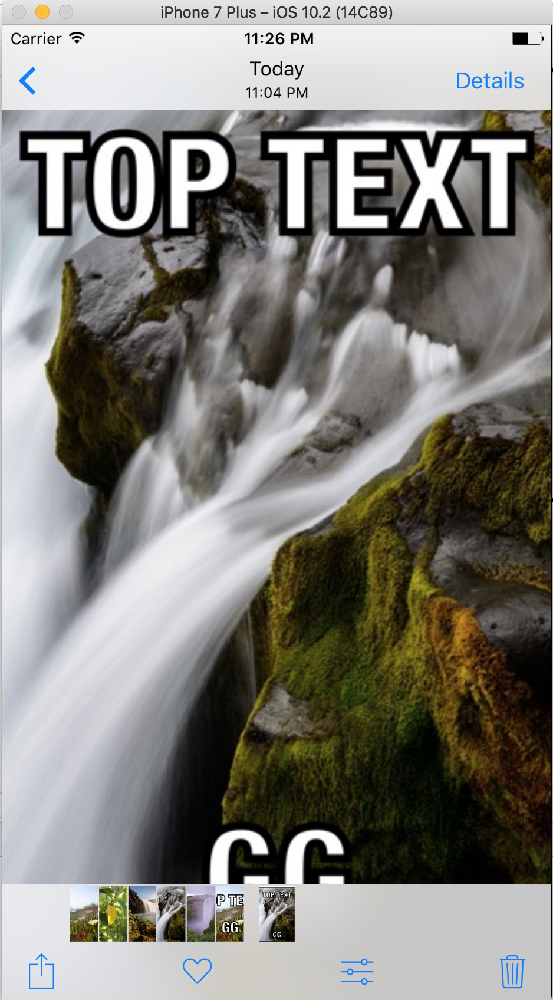

# WeCan_MemeMe_SeungHoonShin
BoostCamp 2차과제 : MemeMe

## Kick - Collection View Cell의 크기 조절
*Collection View* 화면 상단 왼쪽의 슬라이더를 이용하여, 사용자가 Collection View Cell의 크기를 조절할 수 있습니다.

## view 구조

*Tab Bar Controller*에 2개의 *Navigation Contoroller*가 연결.  
*Navigation Contoroller*에는 각각 *Table View Controller* 와 *Collection View Controller*가 *Root View*로 설정 되어있습니다.  
*Table View Controller* 와 *Collection View Controller*에서는 새로운 **Meme**를 만들거나 기존의 **Meme**를 수정할 수 있습니다. 

![MainStoryBoard] (./img/MainStoryBoard.png)

## 초기화면

##상단의 `New` 버튼으로 새로운 **Meme**를 만드는 View Controller로 이동한다.

## Meme를 만드는 모습
 `Save`버튼으로 나만의 **Meme**모음을 만듭니다.

## Share기능

## TableView & CollectionView

*TableView*에 작성한 Text 및 **Meme**생성 시간 추가

## 사진첩에 저장

윗 부분과 아랬부분을 약간 자르고 저장.

